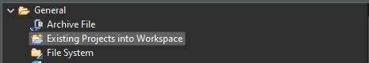

.. _midgard_getting_started_c:

Midgard
=======

Setup
-----

To start developing on the Yggdrasil platform using Midgard, the following things are needed:

.. seealso::
    * `STM32CubeIDE <https://www.st.com/en/development-tools/stm32cubeide.html>`_
    * `Midgard Template <https://gitlab.ti.bfh.ch/sagen1/midgard>`_

After starting the IDE for the first time, close the welcome screen and click on ``File -> Import...``.
Then import the Midgard Template using the ``Existing Project into Workspace`` option.

Getting Started
---------------

For starting with embedded C development, open ``Core/Src/main.c``, scroll down to the empty infinite loop inside the ``main`` function and start adding your code there.