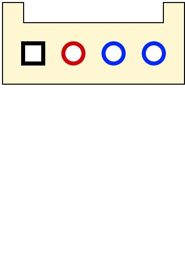
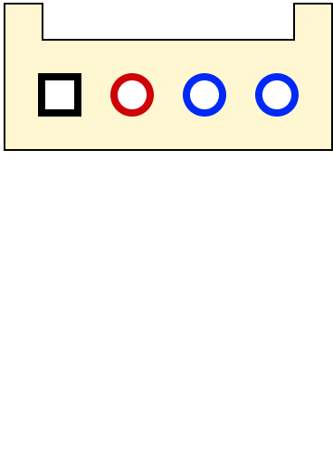

.. _GroveConnector:

Grove Connectors
================

Grove is a standardized connector for all sort of sensor extension boards developed by Seeed and others. 

.. seealso::
    * :ref:`I2C Hardware Driver <I2cInterfaceCpp>`

Grove Power
-----------

Different types of Grove extension boards need different supply voltages. Therefor it's possible to choose between 3.3V and 5V to be applied to all ``Vgrove`` Pins by changing the position of Jumper ``JP3`` located next to the Grove A connector.

.. warning::
    Make absolutely sure that the Grove Power Jumper is set to the correct setting **before** pluging in a board. A wrong setting
    may fry the extension board. 

Connector
---------

Grove A
^^^^^^^

Grove B
^^^^^^^

