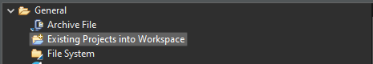

.. _midgard_getting_started:

Midgard
=======

Setup
-----

To start developing on the Yggdrasil platform using Midgard, the following things are needed:

.. seealso::
    * `STM32CubeIDE <https://www.st.com/en/development-tools/stm32cubeide.html>`_
    * `Midgard Template <https://gitlab.ti.bfh.ch/sagen1/midgard>`_

After starting the IDE for the first time, close the welcome screen and click on ``File -> Import...``.
Then import the Midgard Template using the ``Existing Project into Workspace`` option.

Getting Started
---------------

Using C
^^^^^^^

For starting with embedded C development, open ``Core/Src/main.c``, scroll down to the empty infinite loop inside the ``main`` function and start adding your code there.

Using C++
^^^^^^^^^

For starting with embedded C++ development, a few more things are needed.
First, create a new file called e.g ``cpp_main.cpp`` in the ``Core/Src`` folder. In there, include ``<yggdrasil.h>`` and create a new function like this:

.. code-block:: cpp

    #include <yggdrasil.h>

    C_LINKAGE void cpp_main() {

    }

Then in ``main.c`` again, add a function prototype to the top of the file:

.. code-block:: cpp

    void cpp_main(void);

Now call this function above the infinite loop in ``main`` and add all your C++ code to the ``cpp_main`` function.