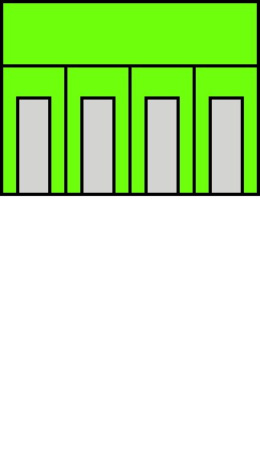
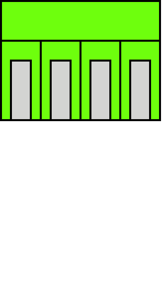

.. _CanConnector:

CAN Connectors
==============

The CAN connectors give access to two, optionally terminated CAN interfaces. 

.. seealso::
    * :ref:`CAN Hardware Driver <CanInterface>`

.. important::
    Both CAN connectors are Galvantically isolated from the rest of Yggdrasil. They need therefor be supplied externally using the screw terminals.

Connector
---------

CAN A
^^^^^

CAN B
^^^^^

Termination
-----------

The last device on the CAN bus is required to terminate the bus with a :math:`120\Omega` resistor. This can be done by bridging the termination jumpers JP4 or JP5 